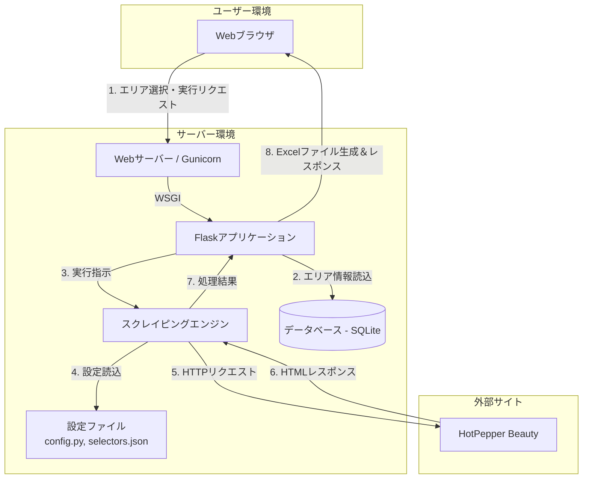

## HotPepperBeautyサロン情報スクレイピングアプリ 要件定義書

### 1. はじめに

### 1.1. 文書目的

本文書は、「HotPepperBeautyサロン情報スクレイピングアプリ」（以下、本システム）の開発にあたり、その仕様、機能、および非機能要件を定義するものです。

### 1.2. アプリケーションの概要

本システムは、ユーザーがWebブラウザ上で操作する**Flaskアプリケーション**です。ユーザーがドロップダウンリストから指定した美容室エリア（例：「銀座・有楽町」）に対し、Webスクレイピングを実行します。対象サイト（ホットペッパービューティー）から、エリア内の全サロンの「サロン名」「電話番号」「住所」などの情報を収集し、**エリアごとのExcelファイルとして出力・ダウンロードさせる**ことを目的とします。

### 1.3. プロジェクトの目的

美容室集客支援事業で利用する営業リストの作成を自動化し、工数を削減するとともに、迅速かつ網羅的なデータ収集を実現します。

### 1.4. 用語定義

| 用語 | 説明 |
| --- | --- |
| **本システム** | 今回開発する、FlaskベースのWebアプリケーション全体。 |
| **ユーザー** | 本システムを操作して、スクレイピングを実行する担当者。 |
| **対象サイト** | スクレイピング対象のWebサイト「ホットペッパービューティー」。 |
| **エリア** | スクレイピング対象の地域単位。（例: 「五所川原」、「熊本」など） |
| **サロン** | スクレイピング対象となる個々の美容室。 |
| **エリアURL** | 各エリアのサロン一覧ページのURL。 |
| **サロンURL** | 各サロンの詳細情報ページのURL。 |

---

### 2. システム概要

### 2.1. システム構成図



### 2.2. 機能一覧

| 大項目 | 機能 | 概要 |
| --- | --- | --- |
| **画面機能** | エリア選択・実行機能 | ユーザーが画面上でエリアを選択し、処理を開始できる。 |
|  | 処理状況表示機能 | 処理の進捗状況をユーザーにリアルタイムでフィードバックする。 |
|  | 結果ダウンロード機能 | 完了後、生成されたExcelファイルをダウンロードできる。 |
| **データ管理機能** | エリア情報管理 | 対象エリア情報をデータベースで管理する。 |
| **バッチ処理機能** | スクレイピング実行機能 | 選択されたエリアの全サロン情報を自動収集する。 |
| **設定機能** | 設定ファイル管理 | 処理設定値とCSSセレクタを外部ファイルで管理する。 |

### 2.3. 技術スタック

| 項目 | 内容 |
| --- | --- |
| **プログラミング言語** | Python 3.12.x |
| **Webフレームワーク** | Flask |
| **主要ライブラリ** | ・Requests: HTTP通信 |
| ・BeautifulSoup4: HTMLパース |  |
| ・Pandas / openpyxl: Excelファイル操作 |  |
| ・concurrent.futures: 並列処理 |  |
| **データベース** | SQLite |

---

### 3. 機能要件 (詳細仕様)

### 3.1. 画面仕様 (UI要件)

単一ページのWebアプリケーションとして実装する。

- **画面構成:**
    1. **ヘッダー:** `<h1>Salon Scraper</h1>`, `<p class="subtitle">...</p>`
    2. **エリア選択:** 検索機能付きのカスタムセレクトボックス。
        - エリア検索入力: `<input type="text" id="area-search-input">`
        - 選択済みエリアID（非表示）: `<input type="hidden" name="area_id" id="selected-area-id">`
        - エリア選択肢リスト: `<div id="area-options-list">`
            - 都道府県グループ: `<div class="area-group">`
            - エリア選択肢: `<div class="area-option">`
    3. **実行ボタン:** `<button type="submit" id="run-button">スクレイピング実行</button>`
    4. **処理状況表示カード:** `<div id="status-card">`
        - タイトル: `<span id="status-title">`
        - 詳細: `<div id="status-details">`
        - プログレスバー: `<div id="progress-bar">`
        - 中止ボタン: `<button id="cancel-button">`
    5. **結果表示カード:** `<div id="result-card">`
- **動作仕様:**
    1. 実行ボタン押下後、ボタンは無効化（ローディング状態に）し、`status-card`を表示する。
    2. 処理の進捗に応じて、`status-title`, `status-details`, `progress-bar`の表示を更新する。
    3. 処理完了後、`result-card`にダウンロードリンクや結果プレビューを表示する。
    4. エラー発生時には、`result-card`にエラーメッセージを表示する。
    5. 「処理を中止する」ボタンで実行中のスクレイピングを中断できる。

### 3.2. データ管理仕様

`area.csv`のデータは初期データとして、アプリケーション内のSQLiteデータベースに格納する。

- **データベースファイル名:** `app.db`
- **テーブル定義 (スキーマ):**
    - **テーブル名:** `areas`
    - **カラム:**
        - `id` (INTEGER, PRIMARY KEY, AUTOINCREMENT)
        - `prefecture` (TEXT, NOT NULL)
        - `name` (TEXT, NOT NULL)
        - `url` (TEXT, NOT NULL, UNIQUE)

### 3.3. スクレイピング実行機能

### 処理フロー

1. **エリアURL取得:** ユーザーが選択したエリア名で`areas`テーブルを検索し、対応する`url`を取得する。
2. **総ページ数特定:** エリアURLにアクセスし、ページネーション要素から総ページ数を特定する。
3. **全サロンURL収集:** 総ページ数分ループし、各一覧ページから全サロンのURLを重複なく収集する。
4. **サロン詳細情報取得 (並列処理):**
    - 収集したサロンURLリストを元に、`concurrent.futures.ThreadPoolExecutor`を使用して並列処理を開始する。
    - 並列処理の最大ワーカー数（スレッド数）は、設定ファイル`config.py`の`MAX_WORKERS`から読み込む。
    - 各スレッドは担当のサロンURLにアクセスし、HTMLを取得。
    - 続けて電話番号ページのURLを取得し、そちらにもアクセスして電話番号を抽出する。
    - `selectors.json`に定義されたCSSセレクタを用いて、必要な全情報（サロン名、住所など）を抽出する。
    - リクエストごとに、`config.py`の`REQUEST_WAIT_SECONDS`で指定された秒数だけ待機する。
5. **Excelファイル生成:** 全サロンの情報を集約し、後述の仕様（5.1）に従ってExcelファイルを生成する。

### 3.4. 設定管理仕様

システムの挙動やメンテナンス性を高めるため、設定を外部ファイルで管理する。

- **設定ファイル1 (処理設定): `config.py`**
    - アプリケーションの動作に関する設定値を定義する。
    
    ```python
    # config.py
    # 並列処理の最大ワーカー数
    MAX_WORKERS = 5
    # リクエスト間の待機時間 (秒)
    REQUEST_WAIT_SECONDS = 1
    # リトライ回数
    RETRY_COUNT = 3
    ```
    
- **設定ファイル2 (CSSセレクタ): `selectors.json`**
    
    ```json
    {
      "area_page": {
        "pagination": "div.preListHead p.pa.bottom0.right0",
        "salon_url_in_list": "h3.slnName a"
      },
      "salon_detail": {
        "name": "p.detailTitle a",
        "related_links": "div.mT30.mB20 ul.mT10 a",
        "phone_page_link": "a[href*='/tel/']",
        "address_label": "住所",
        "staff_count_label": "スタッフ数"
      },
      "phone_page": {
        "phone_number": "td.fs16.b"
      }
    }
    ```
    

---

### 4. 非機能要件

### 4.1. パフォーマンス

- サロン詳細情報の取得処理は、設定ファイルで指定されたワーカー数に基づき並列処理を行い、全体の処理時間を短縮する。

### 4.2. 信頼性

- **情報取得失敗:** スクレイピング中に特定の情報項目が取得できなかった場合、その項目は空欄とし、ログに警告を出力して処理を続行する。
- **アクセス失敗:** HTTPリクエストが失敗した場合、`config.py`の`RETRY_COUNT`で指定された回数リトライを行う。

### 4.3. 保守性・拡張性

- Flaskのブループリント機能などを活用し、ルーティング、ビジネスロジック、データモデルを適切に分割する。
- 設定値とCSSセレクタを外部ファイルで管理することで、仕様変更に柔軟に対応できる構造とする。

### 4.4. 倫理的配慮 (サーバー負荷軽減)

- 対象サイトに過度な負荷をかけないよう、リクエストごとに`REQUEST_WAIT_SECONDS`で指定された秒数だけ待機する。

---

### 5. 成果物

### 5.1. Excelファイル仕様

- **ファイル名:** `{エリア名}_{YYYYMMDD_HHMMSS}.xlsx` （例: `銀座・有楽町_20231027_153000.xlsx`）
- **シート名:** `サロンリスト`
- **カラム構成と順序:**
    1. `サロン名`
    2. `電話番号`
    3. `住所`
    4. `スタッフ数`
    5. `関連リンク` (複数ある場合は改行で区切って1つのセルに格納)
    6. `関連リンク数` (取得できた関連リンクの件数)
    7. `サロンURL`

---

### 6. 制約事項と前提条件

- 本システムは、対象サイト「ホットペッパービューティー」のHTML構造に強く依存する。サイト構造が変更された場合、`selectors.json`の修正が必要となる。